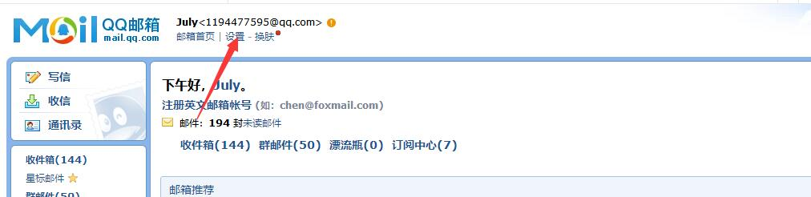
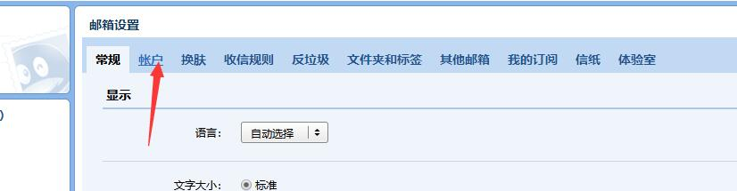
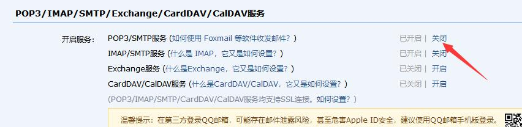

# 使用JavaMailSender发送邮件
## maven依赖
```
<dependency>
    <groupId>org.springframework.boot</groupId>
    <artifactId>spring-boot-starter-mail</artifactId>
</dependency>
```

## 发送简单文本邮件
```
import org.junit.Test;
import org.junit.runner.RunWith;
import org.springframework.beans.factory.annotation.Autowired;
import org.springframework.boot.test.context.SpringBootTest;
import org.springframework.core.io.FileSystemResource;
import org.springframework.mail.SimpleMailMessage;
import org.springframework.mail.javamail.JavaMailSender;
import org.springframework.mail.javamail.MimeMessageHelper;
import org.springframework.test.context.junit4.SpringRunner;
import javax.mail.MessagingException;
import javax.mail.internet.MimeMessage;
import java.io.File;

@RunWith(SpringRunner.class)
@SpringBootTest()
public class SendMail {
    //自动配置邮箱信息
    @Autowired
    private JavaMailSender mailSender;
     @Test
    public void sendSimpleMail(){
        SimpleMailMessage simpleMailMessage = new SimpleMailMessage();
        //邮件发送者的值必须要和properties中配置的邮箱名一致
        simpleMailMessage.setFrom("1194477595@qq.com");
        //发送邮箱的对象
        simpleMailMessage.setTo("1194477595@qq.com");
        //设置标题和正文内容
        simpleMailMessage.setSubject("简单邮件测试");
        simpleMailMessage.setText("Hello World!");
        //发送邮件
        mailSender.send(simpleMailMessage);
    }

```
其中邮箱的用户名和密码在properties中配置
```
spring.mail.host=smtp.qq.com
spring.mail.username=1194477595@qq.com
spring.mail.password=xxxxxxxxxxxxx
spring.mail.properties.mail.smtp.auth=true
spring.mail.properties.mail.smtp.starttls.enable=true
spring.mail.properties.mail.smtp.starttls.required=true
```
其中邮箱的密码是所使用邮箱的授权码，不是邮箱账户的密码，主要用于非本邮箱客户端登录，如何获取授权码，请参照以下步骤（以qq邮箱为例）  



将其打开，授权之后将授权码输入到properties文件中，然后进行测试即可

## 带有附件的邮件
```
@Test
    public void sendAttachmentsMail() throws MessagingException {
        MimeMessage mimeMessage = mailSender.createMimeMessage();
        MimeMessageHelper mimeMessageHelper = new MimeMessageHelper(mimeMessage, true);
        mimeMessageHelper.setFrom("1194477595@qq.com");
        mimeMessageHelper.setTo("1194477595@qq.com");
        mimeMessageHelper.setSubject("主题:有附件的邮件");
        mimeMessageHelper.setText("有附件 的邮件");
        //获取文件
        FileSystemResource file= new FileSystemResource(new File("E:\\Project\\Java\\student-manager\\src\\1.jpg"));
        //写入到附件中
        mimeMessageHelper.addAttachment("附件-1.jpg",file);
        mailSender.send(mimeMessage);
    }
```
刚开始在properties文件中进行注释，结果注释语法出错导致配置文件读取失败